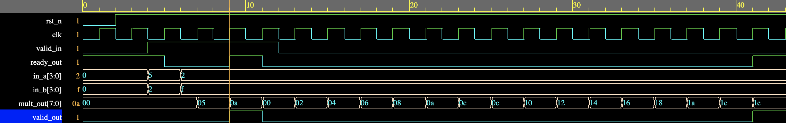

# RTL Design of Multiplication using Repeated Addition Algorithm [SystemVerilog]

Multiplication is one of the fundamental arithmetic operation that most of the hardware need to implement.
Multiplication can be done suing many algorithms, in this design I present hardware design using a simple
repeated addition algorithm to multiply two 4-bit unsigned input integers.

The design follows Ready/Valid protocol at the input interface and the RTL is designed as a Finite State Machine (FSM).

Here's the EDAPlayground link for the implemented design: https://www.edaplayground.com/x/FFLL

To understand working of Ready/Valid protocol refer my block at: https://www.autonomousvision.io/blog/formal-approach-to-verification

The waveform below shows the working of the implement algorithm. We see after first set of inputs are applied we get an output of 0x0a at 9ns.
The second input combination produces an output at 41ns. The number of clock cycles will depend on the number of times we have to perform the
repeated addition.

