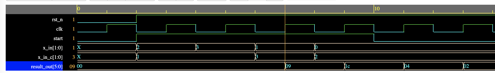
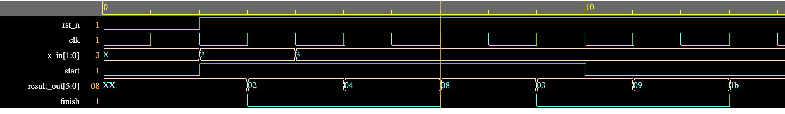

# Pipleline RTL Implementation of a Cubic Polynomial Function [SystemVerilog]

Pipelining is one of most common and powerful approach for designing high speed ASIC/FPGA logic.

Here, I design a cubic equation y = x^3 + k, where x is the input and k is a constant value.
If you synthesize and run the testbench, you will notice three cycle initial latency and after
we have achieved steady state i.e. pipeline is full, the result is generated every clock cycle.
Thereby achieving increased single cycle throughput.

Here's a quick way to run the design using EDAPlayground: https://www.edaplayground.com/x/RNXY

Below we show the waveform after running the EDAPlayground link.
We apply the first input after the first clock and get an output for the first input after the forth clock (0x09).
But we get the next output in the fifth clock (0x1c) and so on.

A sequential implementation of y = x^3 is also designed, for each input it takes three clock to produce an output.
Below we show the waveform for the sequential logic of ploynomial. We see a 3-clock cyles delay between the outputs 0x08 and 0x1b.

