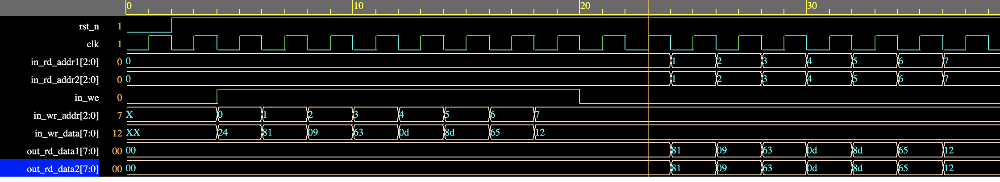

# RTL Implementation of Register File [SystemVerilog]

Register File is one of the fundamental datapath component in CPU/GPU architecture design.
It act as a fast high speed storage for the CPU results.

Typically the first location is always set ot a value of 0.
The location-1 can never be written to a new value. The update happens at the positive edge of the clock and the
read is combinational.

Here's EDAPlayground link to run the design: https://www.edaplayground.com/x/a4Ff

Below an example timing waveform is shown where we first perform the write operation and then the read operation.

