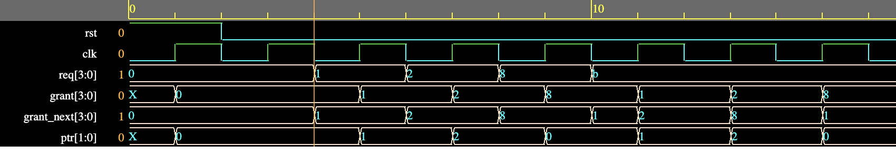

# RTL Design of a 4-I/P Round Robin Arbiter [SystemVerilog]

In many hardware designs we need a module that can arbitrate between multiple inputs (requests) to enable sharing of a common resource.
Arbiter implements that functionality.

Round robin arbiter further enables more fair sharing policy among multiple requesters. Here, I implement a simple 4-input round robin arbiter.
The arbiter grant access to the inputs in a round-robin fashion.

Here's EDAPlaygroud link to run the implemented system: https://www.edaplayground.com/x/knck

Below is a snapshop of timing waveform with the implemented design.

