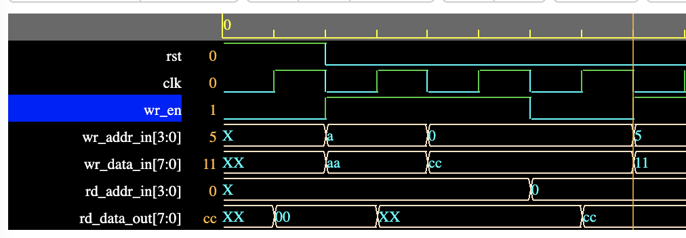

# Synchronous Memory with Data Forwarding [SystemVerilog]

The implemented synchronous memory IP performs the read and the write to locations.
- Reading and writing to the same location results in new write value at the output.
- This is implemented internally by performing data forwarding.

EDAPlayground link to access the simulation: https://www.edaplayground.com/x/C84c

Below, the timing diagram is shown where read and write to the same address is checked.

Above, we see at location 0x5 we write value 0x11. Later, as shown below, after a few clock cycles we update the value at 0x5 and perform the read at the same time.

Here, at the marker, we write data 0xFF at location 0x5 and also provide read address 0x5. We see at the next clock
cycle, the read outoputs the 0xFF value.
